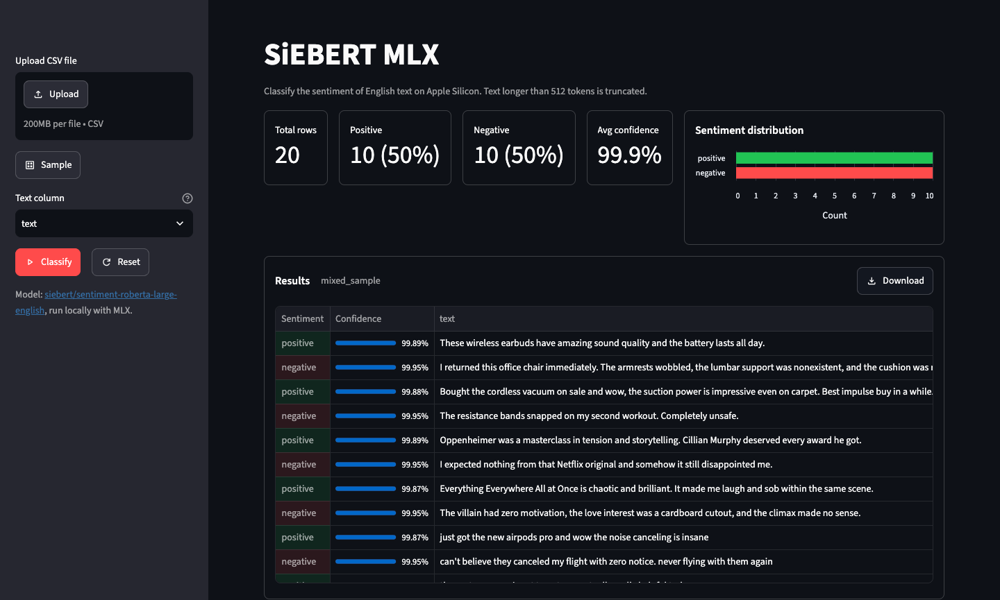

# SiEBERT MLX

[](https://github.com/darylalim/siebert-mlx/actions/workflows/ci.yml)
[](https://github.com/darylalim/siebert-mlx/releases)
[](LICENSE)


Streamlit application for sentiment classification in English text using [SiEBERT](https://huggingface.co/siebert/sentiment-roberta-large-english) on Apple Silicon with MLX.



## Features

- Upload a CSV or try built-in sample data
- Auto-detects text columns with manual override
- Binary sentiment (positive/negative) with confidence scores
- Summary metric cards: total rows, positive/negative counts, average confidence, plus a skipped count when the file has blank text cells
- Sentiment-distribution chart
- Styled results table with CSV download
- Never overwrites your data: a CSV that already has a `Sentiment` or `Confidence` column keeps it, and the model's output is added as `Sentiment (model)` / `Confidence (model)`
- Results persist across interactions; one-click Reset from every state a loaded file can reach
- Streamlit's built-in light and dark themes, switchable from the settings menu
- Batched MLX inference in float16 on Apple Silicon, length-sorted to cut padding waste
- Handles empty, whitespace-only, and malformed input; text longer than 512 tokens is truncated

## Requirements

- **Apple Silicon Mac** (M1 or later) — required. MLX ships arm64-only macOS wheels, so the app will not install or run on Intel Macs, Linux, or Windows.
- **Python 3.12+**
- **[uv](https://docs.astral.sh/uv/getting-started/installation/)** for dependency management

## Setup

```bash
uv sync
```

The SiEBERT model is public, so **no authentication is required**. Optionally, set a [Hugging Face token](https://huggingface.co/settings/tokens) for higher download rate limits (or access to gated/private repos) — either export it or place it in a gitignored `.env` file (loaded automatically):

```bash
export HF_TOKEN=hf_...
```

## Usage

```bash
uv run streamlit run streamlit_app.py
```

On first launch the SiEBERT model (~1.3 GB) is downloaded from Hugging Face and cached under `~/.cache/huggingface`, so the initial **Loading model...** step can take a few minutes. Subsequent launches load from cache.

## Sample Data

`samples/` contains example CSVs:

- `mixed_sample.csv` — 20-row mixed sample, loaded by the **Sample** button
- `product_reviews.csv`, `movie_reviews.csv`, `social_media.csv`, `restaurant_reviews.csv`, `app_reviews.csv` — 40 rows each, one per domain
- `blank_cells.csv` — 10-row edge-case sample with missing and whitespace-only cells in the text column

## Testing

```bash
uv run pytest                              # unit + flow tests (integration skipped)
uv run pytest tests/test_streamlit_app.py  # unit tests
uv run pytest tests/test_app_flow.py       # AppTest flow tests
uv run pytest --integration                # + the real-checkpoint tests
```

Model loading is mocked everywhere except `tests/test_inference_integration.py`,
which loads the real checkpoint and pins what the model actually computes — the
weight/logit dtypes, the label mapping, and a few confidences. Those are skipped
unless you pass `--integration`, because on a cold cache they download ~1.4 GB
and convert it to safetensors.

## Development

Lint, format, and type-check before committing:

```bash
uv run ruff check .          # lint
uv run ruff format --check . # format check
uv run ty check .            # type check
```

CI (`.github/workflows/ci.yml`) runs these same checks plus the test suite on
macOS, then a second job runs the integration tests against the real checkpoint.

### Releases

A third CI job publishes a GitHub Release automatically. **Bumping
`[project].version` in `pyproject.toml` cuts a public release** once that commit
passes both CI jobs on `main` — so treat a version bump as its own change, not
something to fold into an unrelated PR. Release notes are generated from the
commit and PR subjects since the previous tag, so keep those tidy.

The job is a no-op when a tag for the current version already exists, and a PEP
440 pre-release version (`0.8.0rc1`) is marked as a pre-release rather than
becoming "Latest". To release without a version bump — re-cutting a deleted
release, or tagging an older commit — push the tag by hand and
`.github/workflows/release.yml` handles it:

```bash
git tag v0.8.0 && git push origin v0.8.0
```

## Citation

If you use SiEBERT in your work, please cite the following paper:

> Hartmann, J., Heitmann, M., Siebert, C., & Schamp, C. (2023). More than a Feeling: Accuracy and Application of Sentiment Analysis. *International Journal of Research in Marketing*, 40(1), 75-87.

```bibtex
@article{hartmann2023,
  title = {More than a Feeling: Accuracy and Application of Sentiment Analysis},
  journal = {International Journal of Research in Marketing},
  volume = {40},
  number = {1},
  pages = {75-87},
  year = {2023},
  doi = {https://doi.org/10.1016/j.ijresmar.2022.05.005},
  url = {https://www.sciencedirect.com/science/article/pii/S0167811622000477},
  author = {Jochen Hartmann and Mark Heitmann and Christian Siebert and Christina Schamp},
}
```

## License

Released under the [MIT License](LICENSE). This covers the application code in this repository only.

The [SiEBERT model](https://huggingface.co/siebert/sentiment-roberta-large-english) is downloaded at runtime and is subject to its own terms from its model card; it is not redistributed by this project.
